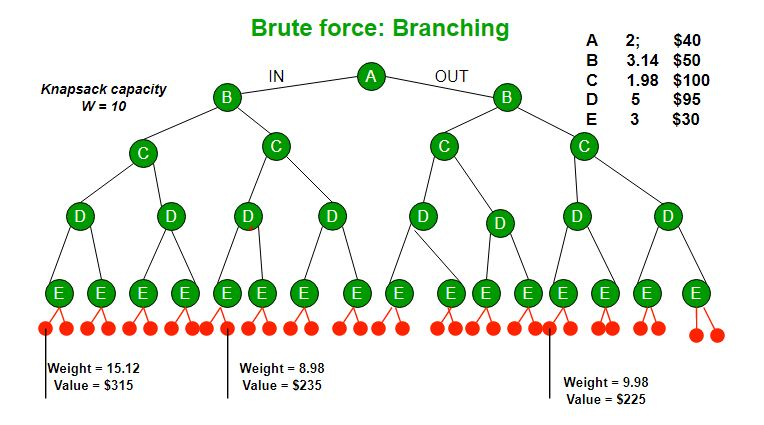

# N Queens Problem 


The knapsack problem is the following problem in combinatorial optimization:

    Given a set of items, each with a weight and a value, determine which items to include in the collection so that the total weight is less than or equal to a given limit and the total value is as large as possible.

It derives its name from the problem faced by someone who is constrained by a fixed-size knapsack and must fill it with the most valuable items. The problem often arises in resource allocation where the decision-makers have to choose from a set of non-divisible projects or tasks under a fixed budget or time constraint, respectively.

The knapsack problem has been studied for more than a century, with early works dating as far back as 1897.[1] 

## Solutions
### Brute Force using Recursion
The concept of the solution is easy. We just need to generate all possible subsets of items and check the total weight and value of each subset and keep track of maximum value subset we have found so far. in other words we will do something similler to a depth first search on all possible subsets and keep track of maximum value subset, where we take or leave the item on each node of the search tree.
This solution will generate a tree of height n and each node will have two children.
weights: [2, 3, 4]
Values: [3, 4, 5]

            (itemNumber, weightCarried)
                      (0,0)
            don't take       take 
                /               \
            (1,0)               (1,3)
            /    \            /       \
        (2,0)    (2,4)     (2,3)      (2,7)
        /   \    /   \     /   \      /   \
    (3,0)(3,5)(3,4)(3,9)(3,3)(3,8) (3,7) (3,12)

                        
So the time complexity of this solution is O(2^n).
Which is a very bad solution for large inputs. cause we can't solve the problem for n>19 in a reasonable time.


### Dynamic programming 
The only way to solve the problem is by having a faster solution. 
To do so we would draw a solution tree to see what could we elemenate of the tree or are calculating something more than once.

- If you look on the photo above you will see that we are calculating the same value more than once. Ex: the tree under B on the right side is the exact same tree under B on the left side. So we can eliminate the right side of the tree and keep the left side only. Also the subtree under all C nodes are the same so we can eliminate them too. 
D node have also the same thing so we can eliminate them too. At the end we would be left with a very small subtree that we have to calculate only once and then reuse the result to calculate the other subtrees.
- The idea is to use a 2D array to store the maximum value of each subset of items. The array will have n rows and W columns. The rows represent the items and the columns represent the weight of the knapsack. The value of each cell is the maximum value of the subset of items represented by the row and the weight represented by the column.

Lets have a look at the code:
```python
# This is the memoization approach of 
# 0 / 1 Knapsack in Python in simple 
# we can say recursion + memoization = DP 
  
  
def knapsack(wt, val, W, n): 
  
    # if we reached the last item or 
    # the weight left in the knapsack is 0 then return 
    if n == 0 or W == 0: 
        return 0
    
    # if we already have the result for this state return that
    if t[n][W] != -1: 
        return t[n][W] 
  
    # choice diagram code 
    # if weight of the nth item is less than the 
    # remaining weight of Knapsack of capacity
    # then we could include the current item in the subset
    if wt[n-1] <= W: 
        # save the maximum solution of both subtrees 
        # of taking the item or leaving it
        t[n][W] = max( 
            val[n-1] + knapsack( 
                wt, val, W-wt[n-1], n-1), 
            knapsack(wt, val, W, n-1)) 
        return t[n][W] 
    
    # if the weight of the nth item is more than the
    # remaining weight of Knapsack of capacity then
    # we can't include the current item in the subset
    elif wt[n-1] > W: 
        # there is only one subtree
        # then we have only one solution to save for this state
        t[n][W] = knapsack(wt, val, W, n-1) 
        return t[n][W] 
  
# Driver code 
if __name__ == '__main__': 
    profit = [60, 100, 120] 
    weight = [10, 20, 30] 
    W = 50
    n = len(profit) 
      
    # We initialize the matrix with -1 at first. 
    t = [[-1 for i in range(W + 1)] for j in range(n + 1)] 
    print(knapsack(weight, profit, W, n)) 
  
# This code is contributed by Prosun Kumar Sarkar 
```

- this Solution is good for the time complexity. It will take O(n*W) time to find the solution. But it will take O(n*W) + O(n) space complexity too. Which is not good for large inputs. So we have to find a way to reduce the space complexity.


### other solutions:
This 2 soltions are not implemented in this repo. 
- Bottom-up Approach for 0/1 Knapsack Problem
- Space optimized Approach for 0/1 Knapsack Problem using Dynamic Programming

The first one will do something similer to the dynamic approach but instead of going through the solution tree from top to bottom it will go from bottom to top. 
The second one will use the same idea of the dynamic approach but it will use only 1D array instead of a 2D array. to save space complexity. And it would be the best aprouch for this problem. where it will have O(n*W) time complexity and O(W) space complexity.


[1]https://en.wikipedia.org/wiki/Knapsack_problem#0-1_knapsack_problem