# N Queens Problem 
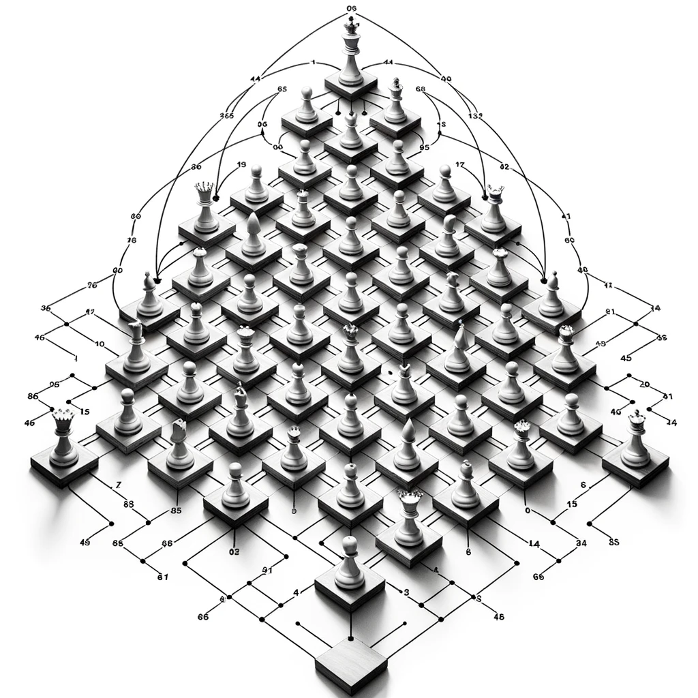

- The eight queens puzzle is the problem of placing eight chess queens on an 8×8 chessboard so that no two queens threaten each other; thus, a solution requires that no two queens share the same row, column, or diagonal. 
- The eight queens puzzle is a special case of the more general n queens problem of placing n non-attacking queens on an n×n chessboard. Solutions exist for all natural numbers n with the exception of n = 2 and n = 3.[1]

## Solutions
### Brute Force

#### Solution:
1. Start with an empty 4x4 board.
2. Place the first queen in the first position of the first square. 

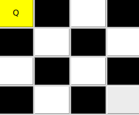

3. Move to the next square and place the second queen in its first position.
4. Continue this for all the queens. 

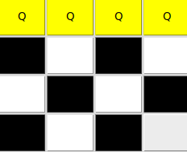

5. After placing the last queen, check if any two queens threaten each other. If they do, backtrack to the last placement and move the queen to the next position.

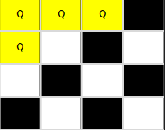

7. Repeat the above steps for every possible arrangement until a valid solution is found.   

Given the brute force nature of this approach, it may take a long time to find a solution for larger boards, but for 4x4, it will generate solutions relatively quickly.
#### Analysis:
In a board we will have n*n squares. each time we place a queen we will have n*n-k squares left to place the rest of the queens. ( where k is the number of the queens we already placed).
That means our solution will take n*(n-1)*(n-2)*...*1 = n! steps to find a solution.
Also at the end of each time we place the queens we have to check if our solution is a valid solution. That means we have to check if any two queens threaten each other. This will take n^2 steps.
So our solution will take n! * n^2 steps to find a solution.
and for the space complexity we will have n*n squares. So our space complexity will be O(n^2) = O(n^2) if we are not saving the valid solutions but printing them directly. If we save the solutions it will be O(n^2 * s) = O(n!). Where s is the number of the valid solutions.
So Brute force is not a valid solution for this problem. Cause with a normal chess board we will have 64*63*...*57 steps to find a solution. That is a huge number.

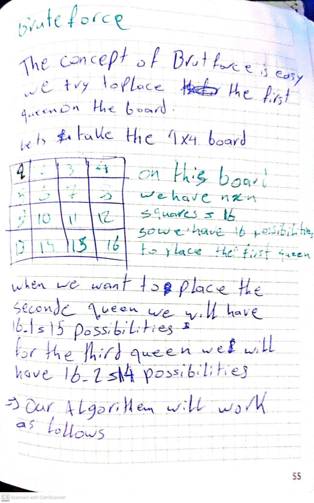
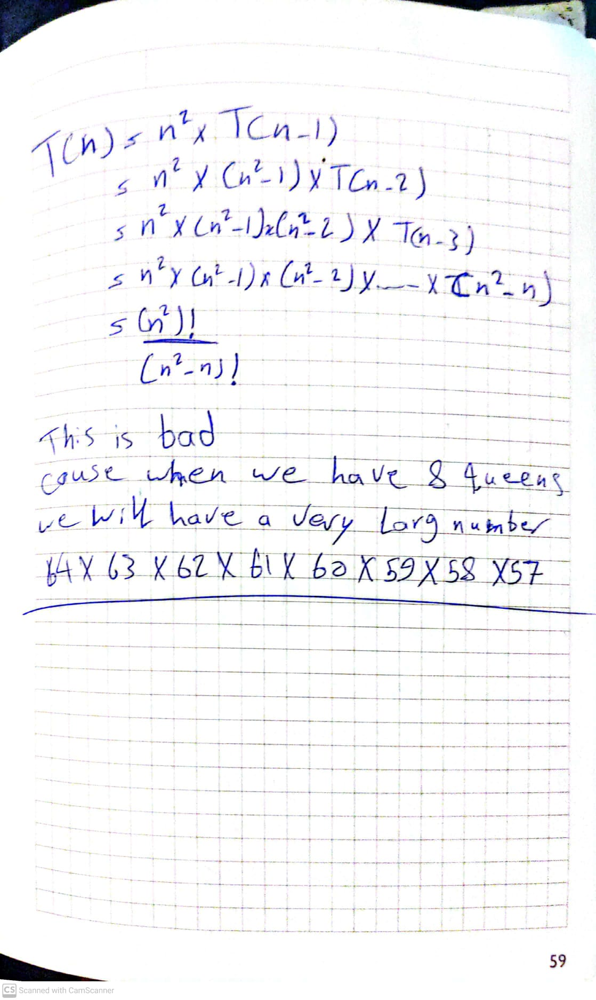

### Backtracking
#### Solution:
If we to minimize the number of steps we have to take to find a solution we have to use backtracking. Backtracking is an algorithmic-technique for solving problems recursively by trying to build a solution incrementally, one piece at a time, removing those solutions that fail to satisfy the constraints of the problem at any point of time (by time, here, is referred to the time elapsed till reaching any level of the search tree).
If we look at the problem we would realize that each time we place a queen we will be elemenating one row and one column. 

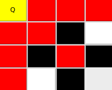

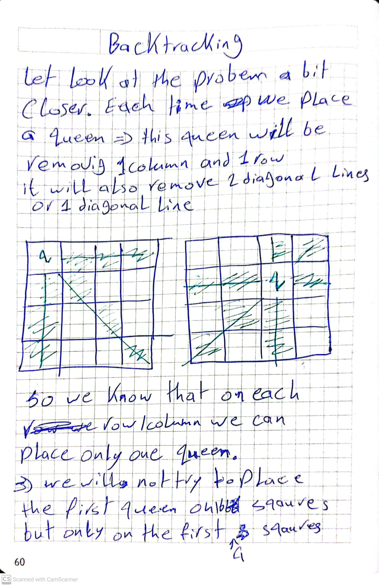
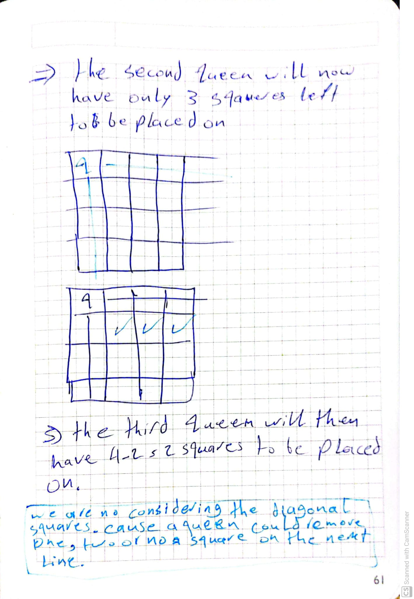
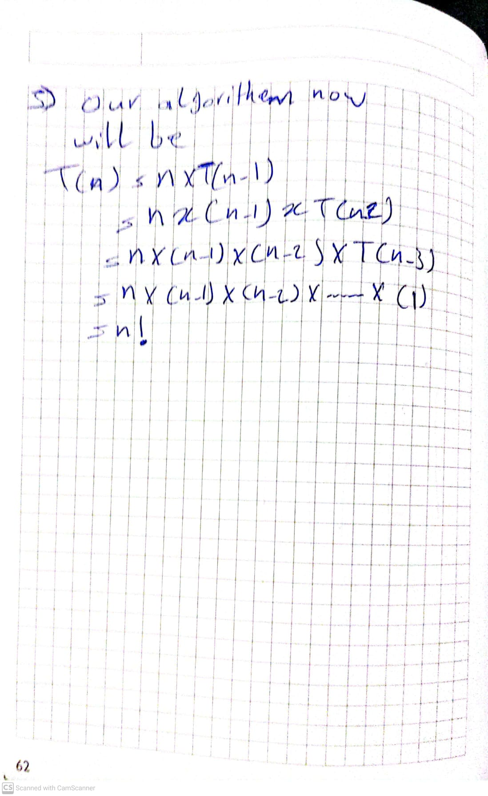

> Also we could do it this time by having only one dimension array. We will have an array of size n. Each element of the array will represent the column of the queen and its index will represtent its row.

> Ex: [1,3,0,2] means we have a queen in the first row and first column, a queen in the second row and third column, a queen in the third row and first column and a queen in the fourth row and second column.

Also to check if two queens threaten each other we will have to check if they are in the same column or in the same diagonal. 2 Queens are in the same diagonal if the difference between their rows is equal to the difference between their columns. Ex: (1,1) and (3,3) are in the same diagonal. (1,1) and (3,2) are not in the same diagonal.

Our solution will have the 3 functions. One to check if two queens are in the same diagonal or in the same column, one to print the solution and one will work recursivly to call it self each time it places a queen.
```python
canPlace(k, i)
// Returns true if a queen can be placed
// in kth row and ith column. Otherwise it
// returns false. X[] is a global array
// whose first (k-1) values have been set.
// Abs( ) returns absolute value of r
   for j := 1 to k-1 do
        // Two in the same column
        // or in the same diagonal
        if ((x[j] == i)  or
            (abs(x[j] – i) = Abs(j – k)))
           then return false
   return true

// Using backtracking, this procedure prints all 
// possible placements of n queens on an n×n 
// chessboard so that they are nonattacking.
nQueens(k, n) : 
      for i:= 1 to n do
         if Place(k, i) then
             x[k] = i
             if (k == n)
                write (x[1:n])
             else 
               NQueens(k+1, n)
  ```

#### Analysis:
The solution tree will look something like this:
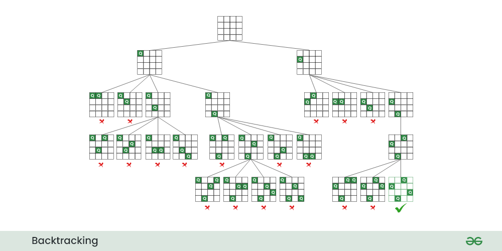


[1]https://en.wikipedia.org/wiki/Eight_queens_puzzle