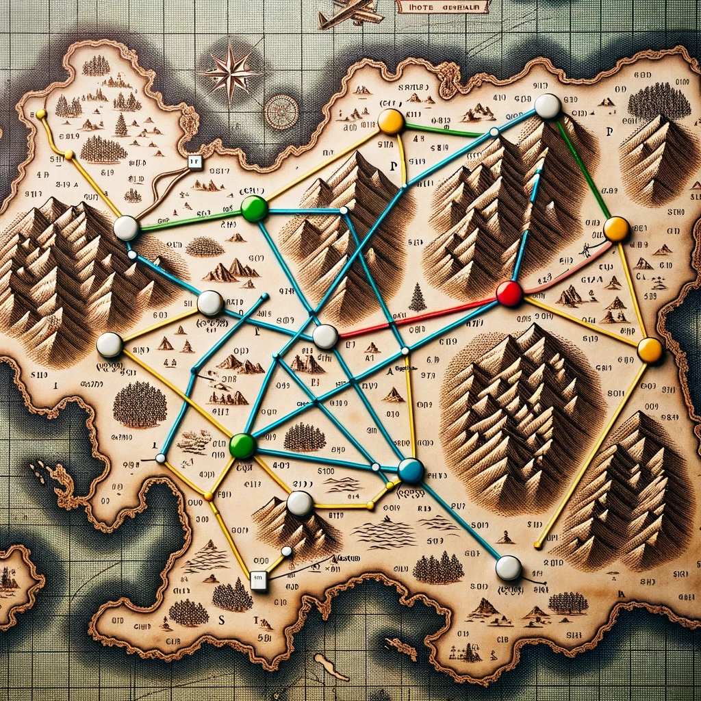

# A* search algorithm 

A* (pronounced "A-star") is a graph traversal and path search algorithm, which is used in many fields of computer science due to its completeness, optimality, and optimal efficiency. One major practical drawback is its O ( b d ) O(b^d) space complexity, as it stores all generated nodes in memory. Thus, in practical travel-routing systems, it is generally outperformed by algorithms that can pre-process the graph to attain better performance, as well as memory-bounded approaches; however, A* is still the best solution in many cases.[1]

## Solution:
- open list is the list of the nodes that we can move to from the node where we are standing. 
- closed list is the list of the nodes that we already visited.
- f cost is the sum of g cost and h cost. g cost is the cost of moving from the start node to the current node. h cost is the cost of moving from the current node to the end node.

1 - we start at the start node and add it to the closed list. 

2- we add all the neighbors of the start node to the open list.

3- we check the open list and find the node with the lowest f cost. (f cost = g cost + h cost)

4- we add that node to the closed list and remove it from the open list.

5- we repeat the above steps until we reach the end node.

6- if we reach the end node we are done. if we don't reach the end node we don't have a solution.

## Analysis:

- The time complexity of the A* algorithm depends on the heuristic. If the heuristic is admissible, meaning that it never overestimates the actual cost to get to the goal, the complexity is O(b^d) where b is the branching factor (the average number of successors per state) and d is the depth of the goal state. That means the more efficient our heuristic is the less time it will take to find a solution.

[1] https://en.wikipedia.org/wiki/A*_search_algorithm